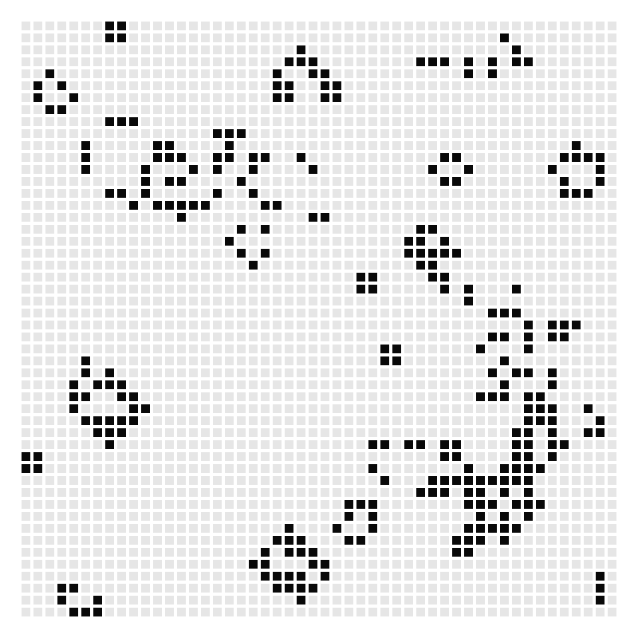

# Hodgepodge

* [algorithm](algorithm/)：实现一些算法
  
  * [cpy.c](algorithm/cpy.c)：c语言中的`memcpy`和`strcpy`
  * [sort.c](algorithm/sort.cpp)：冒泡、选择、插入、归并、堆排、快排
  * [split](algorithm/split.cpp)：字符串分割
  * [cache_replacement](algorithm/cache_replacement.cpp)：缓存淘汰算法`LRU`
  * [shared_ptr](algorithm/shared_ptr.cpp)：shared_ptr实现原理
  
* [tools](./tools)

  * [threadPool](tools/threadPool)：固定数目线程池

* [toy](toy/)

  * [lifeGame](toy/lifeGame/)：[生命游戏](https://baike.baidu.com/item/%E5%BA%B7%E5%A8%81%E7%94%9F%E5%91%BD%E6%B8%B8%E6%88%8F/22668799?fromtitle=%E7%94%9F%E5%91%BD%E6%B8%B8%E6%88%8F&fromid=2926434&fr=aladdin)，依赖SDL2

    

    
  * AmazingBrick：依赖pygame、pygame_colliders

    

